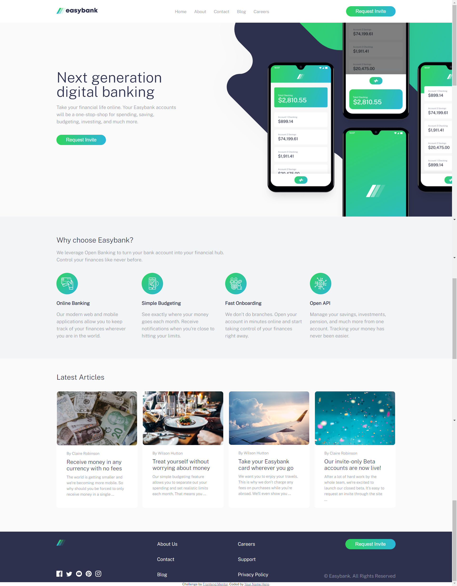

# Frontend Mentor - Easybank landing page

## Feature

- View the optimal layout for the site depending on their device's screen size
- See hover states for all interactive elements on the page

## Built with

- HTML
- SASS CSS
- JAVASCRIPT
- VSCODE LIVE SASS COMPILER EXTENSION BY GLENN MARK

## To run on your local environment
- Create a different branch 
- clone repo using "git clone "
- intall VSCODE LIVE SASS COMPILER EXTENSION BY GLENN MARK
## Hosted Link

https://mellow-druid-e222a3.netlify.app/

